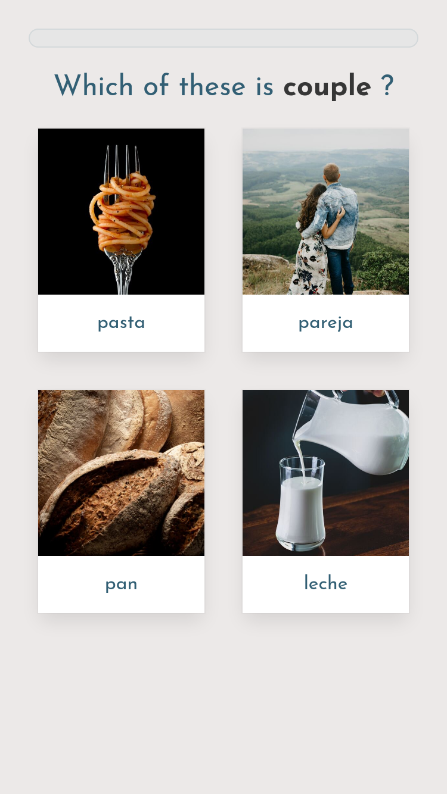

# README

   

## LibreLingo

_an experiment to create a community-driven language-learning platform_

 [Start learning!](https://librelingo.app/) • [Chat with us!](https://riot.im/app/#/room/#librelingo:matrix.org) • [Become a contributor!](./#become-a-contributor) • [Why I built LibreLingo](https://dev.to/kantord/why-i-built-librelingo-280o) • [Good first issues!](https://github.com/kantord/LibreLingo/issues?q=is%3Aopen+is%3Aissue+label%3A%22good+first+issue%22)

### Project goal

My goal is to start a community-driven language-learning platform that gives its users and contributors a way to influence its future and adapt it to special requirements.

To achieve that, I release all source code under the AGPLv3 free software license, which guarantees end users the freedom to run, study, share, and modify the software.

In addition to licensing the software under a free software license, the course content will be decoupled from the software itself, and the development of AGPLv3 or public domain course content will be encouraged. This should allow course developers to retain the freedom to choose how they use their work.

Once course content is properly decoupled from the software, it should be possible to experiment with alternative ways of using course content: for example, the creation of audiobooks or print material.

If you want to learn more about LibreLingo's background, [I recommend reading my article](https://dev.to/kantord/why-i-built-librelingo-280o).

### Screenshots

    

### Milestones

Here's a rough sketch of how I imagine the milestones of this project:

#### First demo

* ☑️ Demo course content in Spanish for English speakers
* ☑️ Some basic building blocks of course content implemented
* ☑️ Developers can use course editor
* ☑️ Basic theme/branding

#### Alpha release

* ☑️ Course progress can be properly synchronised across devices
* ☑️ Course editor can be accessed by all course contributors
* ☐ Statistics about course contributors are collected and published
* ☑️ At least the basics of the Spanish course are ready
* ☑️ Most of the course building blocks are implemented

#### Beta release

* ☑️ All of the basic building blocks of courses are implemented
* ☐ More advanced learning features \(reading exercises\)
* ☑️ Spaced repetition implemented
* ☐ Spanish course is stable and useful
* ☐ Course editor publicly accessible 

#### Stable release\(s\)

* ☐ Any user can build their own course
* ☐ Users can suggest changes to course content
* ☐ There's a marketplace for "unofficial" courses
* ☐ Multiple stable courses available
* ☐ Mobile apps available
* ☐ Wiki features
* ☐ Dictionary
* ☐ Speaking exercises

### Become a contributor

#### Contribute to course material

If you are interested in contributing to course development, please fill the following form: [https://danielkantor196881.typeform.com/to/V00Paz](https://danielkantor196881.typeform.com/to/V00Paz). The project is in a very early stage right now, so you might not be able to contribute right away. Your work will be released in this GitHub repository and you will show up as a contributor here.

#### UI translation

[See docs](https://librelingo.readthedocs.io/en/latest/translation/#translation)

#### Development and other forms of contribution

* [Getting started](https://github.com/kantord/LibreLingo/blob/master/docs/CONTRIBUTING.md)
* [Development documentation is available on Read the Docs](https://librelingo.readthedocs.io/en/latest/)

You can help LibreLingo by testing it and submitting feature requests or bug reports: [https://github.com/kantord/LibreLingo/issues/new](https://github.com/kantord/LibreLingo/issues/new). If you want to get in touch, you can use my contact details on [my GitHub profile](https://github.com/kantord).

**Confused? Have a question?**

There is a Matrix/FreeNode IRC channel `#LibreLingo`, instructions for joining:

* Matrix: [`#LibreLingo`](https://riot.im/app/#/room/#librelingo:matrix.org) on `matrix.org`
* IRC: connect to `irc.freenode.net` with your favourite client and join `#LibreLingo`

### Tech stack

| ​ | Web app/PWA | Course editor |
| :--- | :--- | :--- |
| Frontend | Svelte | Django Admin\* |
| Backend | CouchDB |  |

\* Djando Admin might be replaced in the future

Testing is done using Jest and Cypress. Other technology in use include: bulma, webpack, etc.

### Articles

* [Why I built LibreLingo](https://dev.to/kantord/why-i-built-librelingo-280o)

### License

LibreLingo is licensed under the AGPL-3.0 License. Course content and other creative content might be licensed under other licenses, such as CC.

This image shows a summary of the licensing of our dependencies:

#### Mascot

  
Mascot images are released under [Creative Commons Attribution-ShareAlike 4.0 International License](http://creativecommons.org/licenses/by-sa/4.0/).

The mascot is designed by [@almostdesigner](https://github.com/almostdesigner).

### Contributors ✨

 

Thanks goes to these wonderful people \([emoji key](https://allcontributors.org/docs/en/emoji-key)\):

| [ **Daniel Kantor**](https://www.daniel-kantor.com/cv/) [💻](https://github.com/kantord/LibreLingo/commits?author=kantord) | [ **Klemen Skerbiš**](https://github.com/aha999) [🤔](./#ideas-aha999) | [ **Mirek Mazel**](https://github.com/12people) [🤔](./#ideas-12people) | [ **Chris Babcock**](http://tbg.asciiking.com/about.html) [🤔](./#ideas-swift2plunder) | [ **Liaizon Wakest**](http://wake.st) [🤔](./#ideas-wakest) | [ **Trolli Schmittlauch**](https://github.com/schmittlauch) [🤔](./#ideas-schmittlauch) | [ **Jérôme Deuchnord**](https://deuchnord.fr) [🤔](./#ideas-Deuchnord) |
| :--- | :--- | :--- | :--- | :--- | :--- | :--- |
| [ **Felix Ableitner**](https://gitea.nutomic.com/nutomic) [🐛](https://github.com/kantord/LibreLingo/issues?q=author%3ANutomic) | [ **Navan Chauhan**](http://navanchauhan.me) [🚇](./#infra-navanchauhan) [💻](https://github.com/kantord/LibreLingo/commits?author=navanchauhan) [🎨](./#design-navanchauhan) [📖](https://github.com/kantord/LibreLingo/commits?author=navanchauhan) | [ **Roshan Jossy**](http://roshanjossey.github.io) [🤔](./#ideas-Roshanjossey) [💻](https://github.com/kantord/LibreLingo/commits?author=Roshanjossey) [📖](https://github.com/kantord/LibreLingo/commits?author=Roshanjossey) | [ **ledgelight**](https://github.com/ledgelight) [🤔](./#ideas-ledgelight) | [ **Francis Tyers**](http://xixona.dlsi.ua.es/~fran/) [🤔](./#ideas-ftyers) [📖](https://github.com/kantord/LibreLingo/commits?author=ftyers) | [ **titanix**](https://netspring.wordpress.com) [🤔](./#ideas-titanix) | [ **Michael Moroni**](http://diasp.eu/u/airon90) [🌍](./#translation-airon90) |
| [ **pssandhu**](https://github.com/pssandhu) [🎨](./#design-pssandhu) | [ **Stefan Lobbenmeier**](https://github.com/StefanLobbenmeier) [🐛](https://github.com/kantord/LibreLingo/issues?q=author%3AStefanLobbenmeier) | [ **kylepollina**](https://kylepollina.github.io/) [💻](https://github.com/kantord/LibreLingo/commits?author=kylepollina) | [ **slesingerm**](https://github.com/slesingerm) [🤔](./#ideas-slesingerm) [🐛](https://github.com/kantord/LibreLingo/issues?q=author%3Aslesingerm) [👀](https://github.com/kantord/LibreLingo/pulls?q=is%3Apr+reviewed-by%3Aslesingerm) | [ **iasonasma**](https://github.com/iasonasma) [💻](https://github.com/kantord/LibreLingo/commits?author=iasonasma) [⚠️](https://github.com/kantord/LibreLingo/commits?author=iasonasma) | [ **Caroline Delesalle**](http://carolinedelesalle.com) [🎨](./#design-almostdesigner) | [ **borbota**](https://github.com/borbota) [🐛](https://github.com/kantord/LibreLingo/issues?q=author%3Aborbota) |
| [ **decentral1se**](https://decentral1.se/) [📖](https://github.com/kantord/LibreLingo/commits?author=decentral1se) [🤔](./#ideas-decentral1se) | [ **James Adams**](https://www.drought.gov/drought/data-maps-tools/software) [🐛](https://github.com/kantord/LibreLingo/issues?q=author%3Amonocongo) | [ **Arnold Schrijver**](https://innercircles.community) [🤔](./#ideas-aschrijver) | [ **Dale Visser**](http://dalevisser.wordpress.com/) [🐛](https://github.com/kantord/LibreLingo/issues?q=author%3Adwvisser) | [ **oscarfrancois**](https://github.com/oscarfrancois) [📖](https://github.com/kantord/LibreLingo/commits?author=oscarfrancois) | [ **dhelmr**](https://github.com/dhelmr) [💻](https://github.com/kantord/LibreLingo/commits?author=dhelmr) | [ **Matt**](https://doamatto.xyz) [👀](https://github.com/kantord/LibreLingo/pulls?q=is%3Apr+reviewed-by%3Adoamatto) [🐛](https://github.com/kantord/LibreLingo/issues?q=author%3Adoamatto) [🚧](./#maintenance-doamatto) [💻](https://github.com/kantord/LibreLingo/commits?author=doamatto) [📖](https://github.com/kantord/LibreLingo/commits?author=doamatto) |
| [ **Jean-André Santoni**](http://www.lakka.tv) [🤔](./#ideas-kivutar) [📖](https://github.com/kantord/LibreLingo/commits?author=kivutar) [🎨](./#design-kivutar) | [ **Lucas Campos Teixeira e Nascimento**](https://github.com/LucasCTN) [📖](https://github.com/kantord/LibreLingo/commits?author=LucasCTN) [🤔](./#ideas-LucasCTN) | [ **Pooja Desur**](https://github.com/poojadesur) [📖](https://github.com/kantord/LibreLingo/commits?author=poojadesur) | [ **Wesley Mutwiri**](https://github.com/wesleymutwiri) [💻](https://github.com/kantord/LibreLingo/commits?author=wesleymutwiri) | [ **Simon B.**](https://github.com/sesam) [🤔](./#ideas-sesam) | [ **Karthik Shetty**](https://github.com/karthikshetty03) [🚧](./#maintenance-karthikshetty03) | [ **Joshua Ide**](https://github.com/joshyide) [💻](https://github.com/kantord/LibreLingo/commits?author=joshyide) |
| [ **Jobe Dylbas**](https://github.com/jobedylbas) [💻](https://github.com/kantord/LibreLingo/commits?author=jobedylbas) | [ **Dávid Kristián Luterančík**](https://github.com/DavidLuterancik) [🤔](./#ideas-DavidLuterancik) [💻](https://github.com/kantord/LibreLingo/commits?author=DavidLuterancik) | [ **Sai Sandeep Mutyala**](http://heliostrike.github.io) [💻](https://github.com/kantord/LibreLingo/commits?author=HelioStrike) | [ **Artur Bauer**](https://arturbauer.1mb.site/) [💻](https://github.com/kantord/LibreLingo/commits?author=ArturBa) | [ **Etza**](https://github.com/panditita) [💻](https://github.com/kantord/LibreLingo/commits?author=panditita) | [ **Kyle Mumma**](https://kylemumma.github.io) [💻](https://github.com/kantord/LibreLingo/commits?author=kylemumma) [🤔](./#ideas-kylemumma) | [ **zinovik**](https://github.com/zinovik) [💻](https://github.com/kantord/LibreLingo/commits?author=zinovik) |
| [ **Himank Pathak**](https://himankpathak.me) [💻](https://github.com/kantord/LibreLingo/commits?author=himankpathak) [🐛](https://github.com/kantord/LibreLingo/issues?q=author%3Ahimankpathak) | [ **x4th**](https://github.com/x4th) [💻](https://github.com/kantord/LibreLingo/commits?author=x4th) | [ **Christian Dimas**](https://github.com/kenanchristian) [💻](https://github.com/kantord/LibreLingo/commits?author=kenanchristian) | [ **Marco Ciampa**](https://github.com/ciampix) [🐛](https://github.com/kantord/LibreLingo/issues?q=author%3Aciampix) |  |  |  |

This project follows the [all-contributors](https://github.com/all-contributors/all-contributors) specification. Contributions of any kind welcome!

