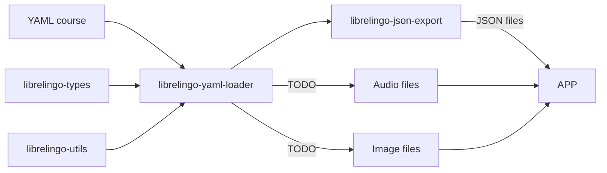

# Development

## Why does this project exist?

This project exists to create a beginner-friendly, community-oriented,
free software licensed language learning application. If you want to learn more
about LibreLingo's background, [I recommend reading my article](https://dev.to/kantord/why-i-built-librelingo-280o).

## Project structure

### Clickable flow chart



## Setting up the development environment

Clone the repository:

```sh
git clone git@github.com:LibreLingo/LibreLingo.git
```

Move into the repo directory:

```sh
cd LibreLingo
```

### Web app

You will need [Node](https://nodejs.org/en/). Note that this project is not yet compatible with Node v16.

Install dependencies:

```sh
yarn set version classic
yarn
```

Start the development server:

```sh
yarn web dev
```

Now you should be able to see your app on <http://localhost:3000/>

### Exporting a course from YAML

If you want to test new features in the YAML format, or some changes in how they are being used
in the frontend, you need to be able to export YAML courses locally.

You will need [Poetry](https://python-poetry.org/).

Install dependencies at the top level and for the app:

```sh
poetry install

cd apps/librelingo_yaml_loader
poetry install
cd ../..

cd apps/librelingo_json_export
poetry install
cd ../..
```

### Locally test LibreLingo with real courses

In order to test LiberLingo with real courses just like in the deployed production version, you
need to install courses locally and export them from YAML to JSON.

#### Install courses

The following command installs all courses listed in the courses.json file just like
in production. *Keep in mind that in order to use them in the frontend, the courses
also need to be exported!*

```bash
yarn web run installAllExternalCourses
```

#### Export courses

In order to use a locally installed course when locally testing the frontend, you should
export the course first. You should also export the course every time you make local
changes to this course and you want the changes to be visible in the frontend.

Use the following command:

```bash
yarn exportAllCourses
```


## Setting up Semaphore CI in a clone

In order for Semaphore CI to correctly operate, you will need to set up certain secrets.

This might not be necessary for you in all cases, but it cannot be avoided if you want to fully fork the repo, or work on CI configuration related tasks.

[Consult this page to read about setting up secrets in Semaphore CI.](https://docs.semaphoreci.com/essentials/using-secrets/)

Here's a list of the tokens you need to set up. Each of them is a link to a page explaining how to obtain the token:

*   [GH\_TOKEN](https://docs.github.com/en/github/authenticating-to-github/creating-a-personal-access-token)
*   [KNAPSACK\_PRO\_TEST\_SUITE\_TOKEN\_CYPRESS](https://www.npmjs.com/package/@knapsack-pro/cypress#configuration-steps)
*   [PERCY\_TOKEN](https://docs.percy.io/docs/environment-variables)

## Testing courses using GitHub gists

It's possible to test courses without them as HTML and deploying them.

One way of doing that is using GitHub gists. You can create a GitHub gist with the course JSON files.

The first step is to export the course as JSON. Then, you have to create a GitHub gist with the
course files.

Keep in mind, that you have to prefix all file names with `librelingo___` and therefore
The first step is to export the course as JSON. Then, you have to create a GitHub gist with the
course files.

Keep in mind, that you have to prefix all file names with `librelingo___` and replace
`/` with `___` in your paths, as GitHub gists don't natively support uploading folders.

So, for example `challenges/animals.json` should be uploaded as the GitHub gist file
`librelingo___challenges___animals.json`.


## Mocks

For mocks in the frontend, LibreLingo uses [MSW](https://mswjs.io/). For Cypress tests, `cy.intercept()` is
used. All of these mocks are defined in apps/web/src/mocks/handlers.js.
